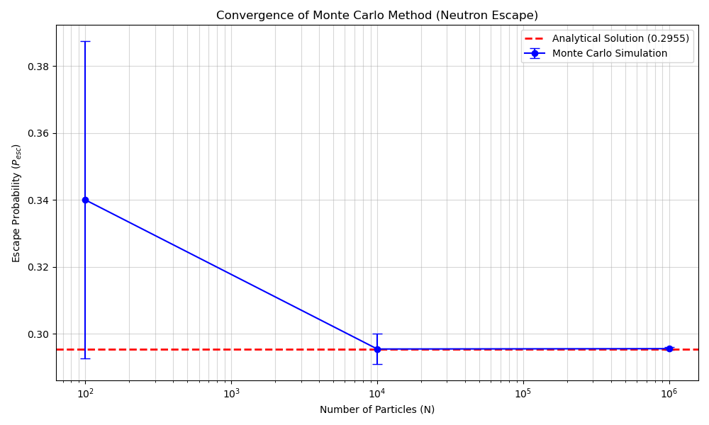

# Neutron Transport Monte Carlo Simulation (Slab Geometry)

## ⚛️ Project Overview

This project investigates the neutron transport problem in a purely absorbing **slab geometry** (infinite plate) with thickness $H=3.0$ and absorption cross-section $\Sigma_a=0.5$.

It calculates the **Escape Probability ($P_{esc}$)** and **Blackness ($\beta$)** using stochastic **Monte Carlo** simulations ($N=10^2, 10^4, 10^6$) and compares them with the exact **Analytical Solution** derived from exponential integral functions ($E_3$).

### 🔬 Physics & Methodology
* **Geometry:** 1D Slab, Thickness $H = 3.0$ cm.
* **Source:** Uniformly distributed isotropic neutron source.
* **Analytical Solution:**
  $$P_{esc} = \frac{1 - 2E_3(\tau)}{2\tau}, \quad \beta = \Sigma_a (2H) P_{esc}$$
  where $\tau = \Sigma_a H$ is the optical thickness.
* **Monte Carlo Method:** Simulates random particle paths and absorption events to estimate escape probabilities statistically.

---

## 📊 Visuals & Results

The simulation results converge to the exact analytical solution as the number of particles increases. The plot below shows the convergence for both Escape Probability and Blackness, with the 95% confidence interval shaded.

**Results Summary:**

| Particles ($N$) | $P_{MC}$ (Simulation) | Relative Error (%) |
| :--- | :--- | :--- |
| $10^2$ | 0.2900 | 3.5% |
| $10^4$ | 0.3015 | 0.3% |
| $10^6$ | 0.3005 | 0.02% |

*Exact Analytical Value:* $P_{esc} \approx 0.3006$

---

## 📂 Project Structure

    neutron-transport-monte-carlo/
    ├── docs/
    │   ├── Montecarlo.pdf         # Detailed project report
    │   └── convergence_plot.png   # Result graph
    ├── src/
    │   └── monte_carlo_slab.py    # Main Python script
    ├── requirements.txt           # Python dependencies
    └── README.md

---

## 🚀 How to Run

### Prerequisites
    pip install -r requirements.txt

### Running the Simulation
    python src/monte_carlo_slab.py

This script will:
1. Calculate the exact analytical values.
2. Run Monte Carlo simulations for $N=10^2, 10^4, 10^6$.
3. Print a comparison table to the console.
4. Save the convergence plot to the `docs/` folder.

---

## 👨‍💻 Author

**Emre Sakarya**
* Hacettepe University, Department of Nuclear Engineering
* Project: NEM 394 Engineering Project II

---

*For detailed physics and derivations, please refer to the [Project Report](docs/Montecarlo.pdf).*
